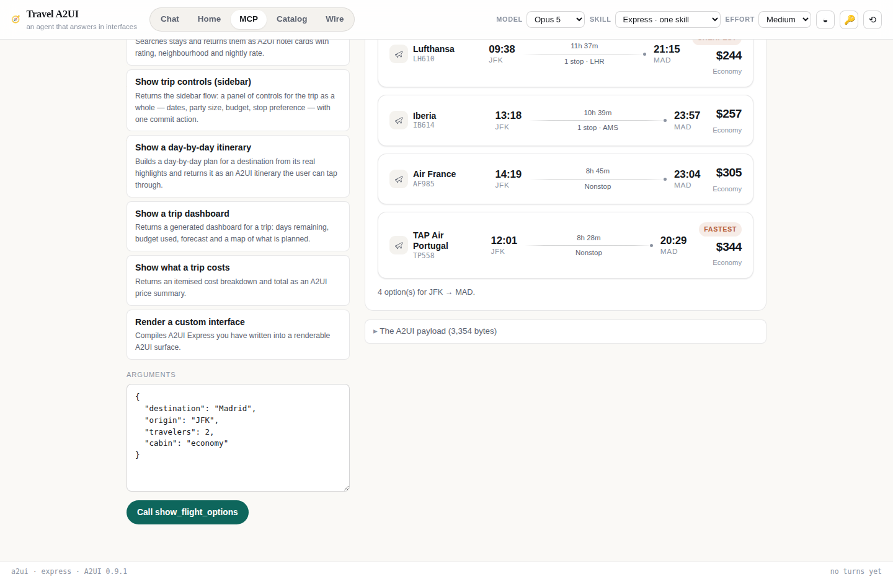
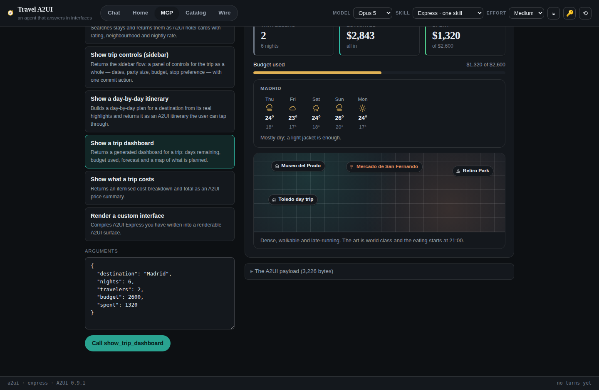
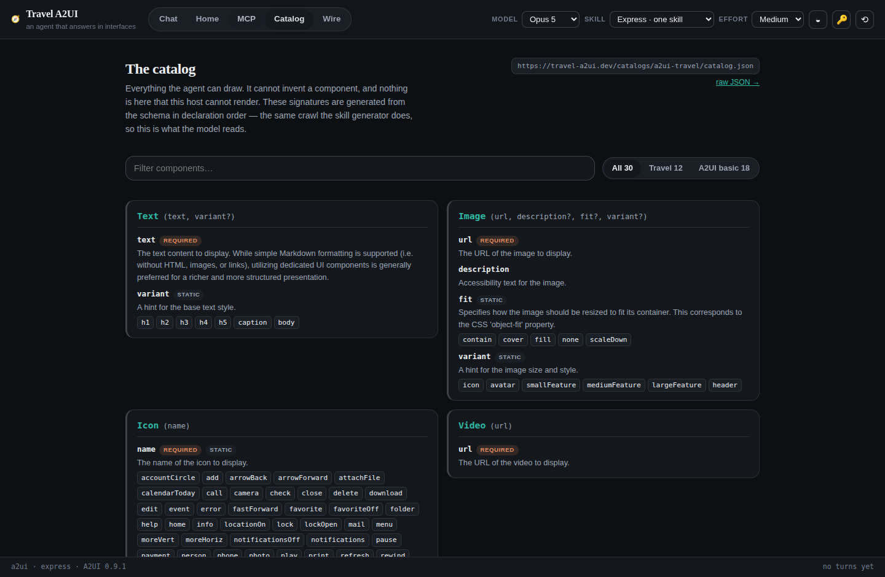
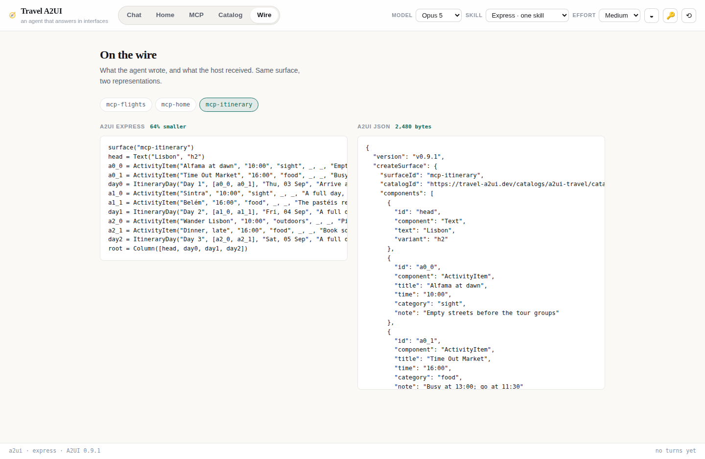
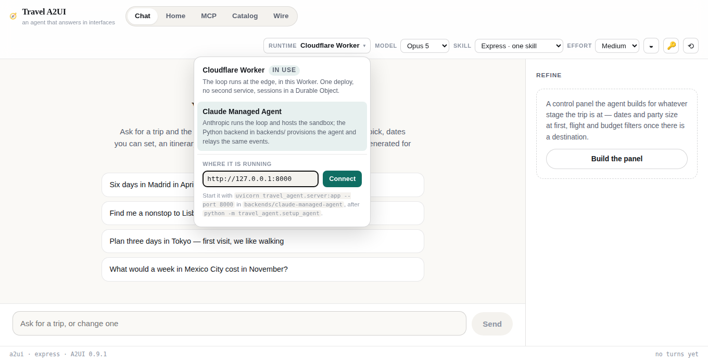
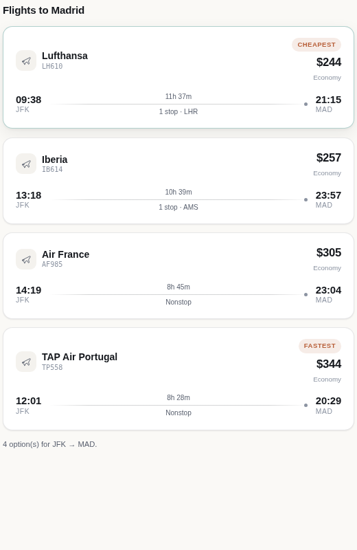
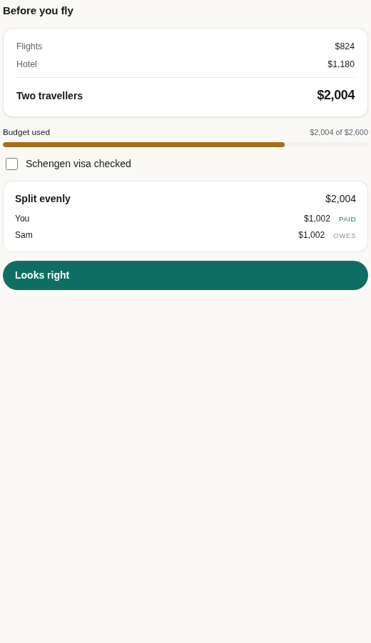

# Travel A2UI

**A travel agent that answers in interfaces.** Ask for a trip and you get flights
you can pick, dates you can set, a day plan you can tap through — generated turn
by turn, not assembled from templates. The backend is a managed agent; the
interface is [A2UI](https://a2ui.org), Google's open protocol for agents that
speak UI.

<p align="center">
  
</p>

The agent never returns HTML, or JSX, or a component name we made up. It writes
**A2UI Express** — a compact notation for a UI tree — and a compiler turns that
into the A2UI JSON any conforming host can render. The one on this page is React;
it could as easily be Flutter, or Claude, or an MCP host you have never heard of.

---

## Why this exists

Chat is a bad interface for choosing between five flights. It is a bad interface
for picking dates, splitting a bill, or seeing what a trip costs. Everyone knows
this, and the usual fix is to hand-build a component for every case the product
team thought of in advance.

Generative UI is the other answer: the model decides what the interface should
be, per turn, from a catalog of components the host already knows how to draw.
A2UI is a real protocol for that, with a real spec and real renderers. This
repository is an attempt to build something complete on top of it — not a demo
of one card, but three ways of putting generated UI in front of a person, an MCP
plugin that carries all three into someone else's agent, two different runtimes
behind it, and the toolchain in between.

The interesting problems turned out to be:

1. **What do you tell the model?** A skill, generated from the catalog, with a
   naming design that keeps implementation detail out of the model's way.
2. **How does it write UI cheaply enough to stream?** A2UI Express, ported to
   TypeScript so it runs in a Worker — about a third the tokens of JSON, and a
   partial program is still a program, so surfaces paint as they arrive.
3. **Where does the interface go?** Inline in the conversation, a persistent
   sidebar, a generated home screen — and then all three again inside Claude,
   through an MCP server that carries the same React renderer.

Two documents worth having open: **[docs/architecture.md](docs/architecture.md)**
for how it is put together, and **[docs/demo-script.md](docs/demo-script.md)**
for six user flows with the exact things to type and what should come back.

The architecture document is the long version: what is
built once and shared, where this sits among the three A2UI × MCP Apps
integration patterns, how a turn flows end to end, and why each of those
decisions went the way it did.

---

## Run it

```bash
git clone <your-repo> && cd travel-a2ui
npm run setup            # installs, regenerates, builds, tests
npm run dev:worker       # http://127.0.0.1:8787
```

Open `http://127.0.0.1:8787` and paste an Anthropic API key when asked — or skip
the form entirely:

```
http://127.0.0.1:8787/#key=sk-ant-...
```

The key is taken out of the URL and the address bar is rewritten before anything
else reads it, then kept in this browser and sent with each request. It is never
stored on the server. `#key=` is the form to use: a fragment never leaves the
browser. `?key=` also works, because people paste it, but the server saw it and
the app says so once — treat such a key as logged. (Get one at
[console.anthropic.com](https://console.anthropic.com/settings/keys).)

The **MCP** tab works with no key at all — those tools compose surfaces from the
catalog without a model in the path, so it is the fastest way to see A2UI render.

For front-end work with hot reload, run both:

```bash
npm run dev:worker       # API + MCP on :8787
npm run dev:web          # Vite on :5173, proxying /api and /mcp
```

### Deploy it

The Worker serves the API, the MCP endpoint and the built web app from one
origin — one deploy, one URL, no CORS to configure.

```bash
npx wrangler login
npm run deploy
```

Or push to `main` with two repository secrets set —
`CLOUDFLARE_API_TOKEN` (the "Edit Cloudflare Workers" template) and
`CLOUDFLARE_ACCOUNT_ID` — and
[`.github/workflows/deploy.yml`](.github/workflows/deploy.yml)
does it. Tests run first; a red build does not deploy.

By default every visitor brings their own key. To run a shared deployment on one
key instead, set it as a Worker secret and the app stops asking:

```bash
npx wrangler secret put ANTHROPIC_API_KEY --cwd apps/worker
```

---

## The three flows

Not three screens — three *placements*, each answering a different question, and
each composing the same data differently. They are properties of where an answer
goes, not of this codebase, which is why they survive the trip into an MCP host.

### 1 · Inline — attached to the message being answered

The user asked something; this is the answer, drawn under it.

- **Scope**: one job. Three flights, not nine. A date picker, not a settings
  panel.
- **Lifetime**: permanent and per-turn. Surface `inline-3` stays live and
  clickable after the conversation moves past it, so you can go back and change
  your mind.
- **Actions continue the conversation.** Picking a flight is the user's next
  turn, phrased in the interface instead of in prose.
- **User flow**: *"Find me a flight to Madrid"* → three `FlightOption`s → tap one
  → the agent saves it and asks about hotels.

### 2 · Sidebar — the trip as a whole

Persistent, beside the conversation. Where the trip is *adjusted* rather than
discussed.

- **Scope**: controls, not content. Dates, party size, budget, filters, what is
  chosen so far. Long prose does not belong here.
- **Lifetime**: singular and replaced. Writing to `sidebar` again rebuilds the
  panel; it is not a feed.
- **Context-aware**: it is regenerated when the trip changes, so a panel of
  destination options becomes a panel of flight filters once a destination is
  settled. Nothing in the app decides that — the agent does, from the trip state.
- **User flow**: change the fare cap and the party size, hit Apply, and the next
  search reflects both.

### 3 · Home — where the trip stands today

Read first, and not in reply to anything.

- **Scope**: the number that matters most right now, then anything needing a
  decision, then context — weather, the map, the next day.
- **Lifetime**: singular, regenerated when the trip or the day changes.
- **Generative layout**: not a fixed dashboard. Ask it to "put the packing list
  on top" or "show the budget as a meter" and the layout changes, because the
  layout is the model's output.
- **User flow**: open the app in the morning → *17 days to Madrid*, budget used,
  the one unbooked thing → tap it and land back in the conversation.

| | Rendered in the app by | Composed for MCP hosts by |
|---|---|---|
| Inline | `apps/web/src/components/Chat.tsx` | `show_flight_options`, `show_hotel_options`, `show_itinerary`, `show_price_summary` |
| Sidebar | `apps/web/src/components/Sidebar.tsx` | `show_trip_controls` |
| Home | `apps/web/src/components/Home.tsx` | `show_trip_dashboard` |

**The same three flows are available over MCP.** Every placing tool takes a
`surface` argument (`inline` \| `sidebar` \| `home`), which changes what is
composed and where it is written — `sidebar` and `home` are singular surfaces
that replace themselves, inline ones are keyed per answer. So a plugin installed
in Claude gets the same product, not a subset of it.

<p align="center">
  
</p>

Two more tabs earn their place. **Catalog** shows every component the agent can
draw, with the exact signatures the model is given — so "what is it allowed to
use" is one click away rather than a JSON schema away.

<p align="center">
  
</p>

**Wire** shows any live surface in both representations, the Express the agent
wrote and the JSON the host received, because "what did the model actually emit"
is the first question anyone asks about generative UI.

<p align="center">
  
</p>

---

## How it fits together

```
catalogs/a2ui-travel/catalog.json      the vocabulary — A2UI basic + 12 travel components
        │
        ├─► tools/skillgen  ──────────► skills/**/SKILL.md      what the model is told
        │                                      │
        │                                      ▼
        │                            apps/worker  (or backends/claude-managed-agent)
        │                                      │  model writes A2UI Express
        │                                      ▼
        └─► packages/express ─────────► A2UI JSON messages
                                               │
                                               ▼
                                     packages/renderer  → React
```

Four things are generated from the catalog and checked in, so a stale one fails
CI rather than shipping quietly:

| Generated | From | Regenerate |
|---|---|---|
| `catalogs/a2ui-travel/catalog.json` | the vendored upstream basic catalog + travel components | `python3 scripts/build_catalog.py` |
| `catalogs/a2ui-travel/examples/compiled/*.json` | the `.express` examples | `node scripts/build_examples.mjs` |
| `skills/**/SKILL.md` | the catalog | `python -m skillgen build --all …` |
| `docs/screenshots/*.png` | the running app | `npm run screenshots` |

`npm run generate` does the first three; `npm run check` fails if any is stale.

---

## The skills

The generator is in [`tools/skillgen`](tools/skillgen), and the design principle
it implements is worth stating on its own:

> A skill's `name` and `description` are what an agent sees during discovery, and
> all it sees before deciding whether to load the thing. So they describe a
> **capability** — "generates interactive user interface components" — and never
> an implementation. Which inference format, which protocol version, which schema
> file: none of that helps a model route a request, and all of it crowds out the
> words that do. Those details go in `metadata`, where SDKs and humans can read
> them and the model pays nothing for them.

Three variants are generated, in sibling directories so the skill *names* stay
clean:

```
skills/
├── express-monolithic/a2ui/SKILL.md                one skill: rules + catalog + examples
├── express-modular/
│   ├── a2ui-core/SKILL.md                          the notation, which never varies
│   └── a2ui-travel/SKILL.md                        this catalog's components
└── direct-json-monolithic/a2ui/SKILL.md            the same UI, emitted as raw A2UI JSON
```

The modular shape is what scales past one domain: an agent working on travel
loads `a2ui-core` + `a2ui-travel` and never pays for the charting catalog. The
`direct_json` variant exists to measure what Express is actually buying you —
same catalog, same examples, different wire form.

You can switch between all three **in the running app**, mid-conversation, from
the header. That is the fastest way to find out whether the split costs anything
on a given model.

No skill ships a script. They are instructions, and a test asserts that each
directory contains nothing but `SKILL.md`.

---

## A2UI Express

The notation the agent writes:

```
surface("inline-flights")
$/trip/selectedOutbound = ""
heading = Text("Outbound · JFK → MAD · Sun 12 Apr", variant="h3")
f1 = FlightOption("Iberia", "18:40", "08:15 +1", "JFK", "MAD", "$412",
                  Event("select_flight", {id: "IB6250"}),
                  duration="7h 35m", stops="Nonstop", badge="Cheapest")
root = Column([heading, f1])
```

Three properties make it worth a compiler:

- **It is about a third the tokens of the equivalent JSON.** The Wire tab prints
  the exact ratio for whatever is on screen.
- **A partial program is still a program.** `root = Column([heading, f1])` is
  valid the moment those lines exist, so the surface paints while the model is
  still typing. Truncated JSON is a parse error.
- **Variables are ids.** The model does not have to invent an id for every
  nested component and then remember it.

[`packages/express`](packages/express) is a TypeScript port of the reference
implementation in [google/a2ui](https://github.com/google/a2ui) — lexer, parser,
compiler, decompiler and a streaming front end, with no ANTLR runtime, so it fits
in a Worker.

**It is diffed against the original.** Twenty cases in `tools/parity/cases` are
compiled by both this and Google's Python compiler and asserted equal. When they
disagree, the golden is right and the port is wrong. Same story on the Python
side: `skillgen`'s signature output is asserted byte-identical to the reference
prompt generator's.

```bash
pip install a2ui-agent-sdk
python3 scripts/gen_parity.py          # regenerate the goldens
npx vitest run packages/express        # 64 tests, including all 20 parity cases
```

---

## Two runtimes, one wire protocol

Pick one in the header — the app switches mid-conversation, because the whole
claim is that the interface layer does not care who runs the loop.

<p align="center">
  
</p>

Switching probes the target's `/api/meta` first, so picking a runtime that is
not running says so in the picker rather than failing on your next message.


| | `apps/worker` (default) | `backends/claude-managed-agent` |
|---|---|---|
| Language | TypeScript | Python |
| Runs the tool loop | this code | Anthropic |
| System prompt | assembled per request | uploaded once, versioned |
| Conversation state | a Durable Object per trip | the managed session |
| Tools | execute in the Worker | the MCP server, called by Anthropic |
| Deploys to | Cloudflare | anywhere Python 3.10+ runs |

Both speak the same `POST /api/chat` SSE protocol, so the front end does not know
which one it is talking to:

```bash
cd backends/claude-managed-agent
pip install -e '.[sdk,dev]'
python -m travel_agent.setup_agent --mcp-url https://<your-worker>.workers.dev/mcp
python -m travel_agent.server
VITE_API_ORIGIN=http://127.0.0.1:8788 npm run dev:web
```

The managed-agent variant closes a nice loop: the agent's tools *are* this
project's MCP server, so Anthropic calls the deployed Worker for travel data and
gets A2UI back.

### The compiler, as a service

Both backends expose `POST /api/compile` and `POST /api/decompile`, so anything
that can POST can speak Express without shipping a parser:

```bash
curl -s localhost:8787/api/compile -H 'content-type: application/json' \
  -d '{"source":"root = Text(\"Hi\", variant=\"h3\")","surfaceId":"demo"}'
```

A compile error comes back as a 422 naming what was wrong — `'colour' is not a
property of Text. Text accepts: text, variant.` — which is what a model needs to
fix it on the next attempt.

### Why the compiler was ported rather than imported

Worth knowing before you assume the Python side is the simpler one: the
**published `a2ui-agent-sdk` (0.5.0) is behind the current Express grammar.** It
rejects `Text("Hi", variant="h3")` — keyword arguments — which is what the
generated skills teach and what a current model writes, and it emits a v1.0
envelope rather than the v0.9.1 message list here.

So the Python backend probes the installed SDK at startup by compiling one
keyword-argument program, uses it when it works, and otherwise delegates to the
compile service above — which is the TypeScript port, diffed against the
reference implementation on twenty cases. When Google publishes a current wheel,
`auto` starts choosing the SDK on its own and that fallback becomes dead code.
That is the intended end state.

---

## The MCP app: the same UI, inside Claude

`POST /mcp` is a stateless Streamable-HTTP MCP server whose tools return
interfaces rather than text. It is the fourth modality and the one that reaches
furthest: the three flows above, drawn by the same React components, inside
someone else's chat app.

**[docs/install-in-claude.md](docs/install-in-claude.md)** is the step-by-step —
Claude Code, Claude Desktop, and claude.ai. The short version:

```bash
claude mcp add --transport http travel-a2ui https://<your-worker>.workers.dev/mcp
```

### What comes back from a tool call

Three things, so that nothing degrades to nothing:

| Part | For | Size |
| --- | --- | --- |
| a plain-text summary | the model, and any host that can't draw | a line |
| `application/vnd.a2ui+json` | a host with its own A2UI renderer | ~2–6 kB |
| a `text/html` shell | every other host, rendered in an iframe | **~450 B** |

The shell is not the renderer. It is the payload inlined, plus a `<script src>`
pointing back at the deployment the host just called — so the 220 kB React
bundle is fetched once and cached, instead of riding along on every tool call
and eating the host's result budget each time. The origin comes from the request
URL, so a production deploy, a preview and `wrangler dev` each serve their own
with nothing configured (`?origin=` overrides it, for a tunnel or a proxy).

A host that renders A2UI natively can drop the HTML with `POST /mcp?view=payload`;
an HTML-only host can drop the payload with `?view=html`.

### Composed on the fly, not a menu of cards

Eight tools, and the split matters:

- `show_flight_options`, `show_hotel_options`, `show_trip_controls`,
  `show_itinerary`, `show_trip_dashboard`, `show_price_summary` — shortcuts for
  the six layouts that come up most, composed from the catalog server-side.
  Fast, deterministic, no second model in the path. Each takes
  `surface: inline | sidebar | home`, so the three flows are available in Claude
  exactly as they are in the web app.
- `get_a2ui_component_reference` → `render_a2ui_express` — **the actual
  capability.** The first returns the generated output contract: the grammar,
  the streaming rules, and the positional signature of all 40-odd components.
  The model reads it once, writes A2UI Express for the layout *this*
  conversation needs, and the second compiles it and hands back a surface drawn
  by the same components. Compile errors come back naming exactly what was
  wrong — including an invented component name, with the list of real ones — so
  a second attempt can fix it.

The reference is a *tool* and not only a prompt on purpose: hosts surface MCP
prompts as something the user must invoke by hand, so a model that can only read
prompts can never learn the vocabulary mid-conversation. As a tool it can.

<p align="center">
  
  
</p>

Left: `show_flight_options`. Right: a pre-flight card — price summary, budget
meter, checkbox, expense split — that no tool hard-codes; the model wrote it as
Express and `render_a2ui_express` compiled it. Both are screenshots from
`tools/e2e/mcp.mjs`, taken inside a `sandbox="allow-scripts"` iframe, which is
the strictest thing a host does.

Calling it directly:

```bash
curl -s localhost:8787/mcp -H 'content-type: application/json' \
  -d '{"jsonrpc":"2.0","id":1,"method":"tools/call","params":{
        "name":"show_flight_options","arguments":{"destination":"Madrid"}}}' | jq
```

---

## Layout

```
travel-a2ui/
├── catalogs/
│   ├── basic/                  vendored A2UI v0.9.1 basic catalog
│   └── a2ui-travel/            generated: basic + 12 travel components, and the examples
├── packages/
│   ├── express/                A2UI Express: lexer, parser, compiler, decompiler, streaming
│   ├── trip/                   what a trip is: schema, coercion, readiness, the plan
│   └── renderer/               React host for both catalogs, and the design system
├── apps/
│   ├── worker/                 Cloudflare Worker: agent loop, Durable Object, MCP server
│   ├── web/                    React app: the three flows, the catalog and the wire inspector
│   └── mcp-view/               the renderer as one self-contained HTML file, for MCP hosts
├── backends/
│   └── claude-managed-agent/   the same agent as an Anthropic-hosted Managed Agent (Python)
├── tools/
│   ├── skillgen/               the skill generator (Python) and its tests
│   ├── parity/                 Express cases + goldens from the reference compiler
│   ├── e2e/                    a whole browser turn against a scripted model
│   └── screenshots/            the README's screenshots, reproducibly
├── scripts/                    setup, generation, parity, and repo extraction
└── skills/                     generated SKILL.md files, checked in
```

---

## Tests

```bash
npm test     # 134 TypeScript tests
npm run e2e  # a whole browser turn, against a scripted model — no API key
python3 -m pytest tools/skillgen/tests backends/claude-managed-agent/tests -q
```

What they actually cover:

- **Parity** — 20 Express programs compiled by both implementations, plus a
  compile → decompile → compile round trip for each.
- **Streaming** — sentinels split across chunks, partial trees rendering, syntax
  errors reported only once a block is finished. Twice: once in TypeScript, once
  in Python.
- **The agent loop** — against a scripted model: prose and UI separated, parallel
  tool results returned in one message, refusals and rejected keys handled.
- **MCP** — driven as a protocol, not as functions: handshake, batches,
  notification semantics, error codes, the three flows, and that the shipped
  HTML view fetches nothing.
- **The host** — data binding, list templates, client-side checks, and that a
  re-sent component replaces rather than duplicates.
- **The skills** — that the model-facing fields leak no implementation detail,
  that the modular pair covers the monolith, and that no skill ships a script.
- **End to end** — a real browser: type a message, watch a surface appear
  mid-stream, click a flight, and assert the click reaches the model as the next
  turn with the surface's data model attached.

---

## Notes on the parts that are simulated

`apps/worker/src/travel.ts` is a deterministic travel-data simulation, not a
booking system. The same query returns the same flights every time, which keeps
screenshots true and tests assertable. Swapping it for a real API changes nothing
above it — that boundary is the point.

Nothing here books anything, takes payment, or talks to a live carrier.

---

## Credits and licence

Apache-2.0. See [NOTICE](NOTICE).

Built on [A2UI](https://a2ui.org) by Google. The Express compiler and the
signature generator are ports of the reference implementations in
[google/a2ui](https://github.com/google/a2ui) (Apache-2.0), kept honest by the
parity suites described above. The basic component catalog is vendored from that
repository's `specification/v0_9_1`.
