# The travel catalog

21 components, every one drawn here by the renderer that ships — not a
mockup. Each picture is a screenshot of the real component, beside the single line
of A2UI Express that produced it.

This page is generated from `catalogs/a2ui-travel/catalog.json` and the gallery
build (`node tools/screenshots/catalog.mjs`), so it cannot describe a component
that no longer exists or miss a prop that was added.

**Lifting one of these.** A component is three things: an entry in the catalog
schema, a React function in `packages/renderer/src/components/`, and whatever the
skill says about when to use it. Copy all three and it works in another A2UI
project — nothing here is coupled to travel except the names.

---

## ActivityItem

<picture>
  <source media="(prefers-color-scheme: dark)" srcset="catalog/ActivityItem-dark.png">
  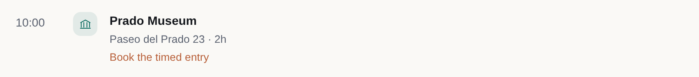
</picture>

```
root = ActivityItem("Prado Museum", "10:00", category="sight", location="Paseo del Prado 23", duration="2h", note="Book the timed entry")
```

| prop | type | | what it is |
| --- | --- | --- | --- |
| `title` | bindable string | **required** | What it is, e.g. 'Prado Museum'. |
| `time` | bindable string |  | Start time as a display string, e.g. '10:00'. |
| `category` | `food` \\| `sight` \\| `transit` \\| `stay` \\| `outdoors` \\| `shopping` \\| `event` \\| `free` |  | Drives the icon and colour the host uses. |
| `location` | bindable string |  | Where it happens, e.g. 'Paseo del Prado 23'. |
| `duration` | bindable string |  | How long to budget, e.g. '2h'. |
| `note` | bindable string |  | One short practical note, e.g. 'Book the timed entry'. |
| `action` | action |  | Fired when the traveler taps the activity. |
| `done` | bindable boolean |  | Whether the traveler has ticked this off. |

## Button

<picture>
  <source media="(prefers-color-scheme: dark)" srcset="catalog/Button-dark.png">
  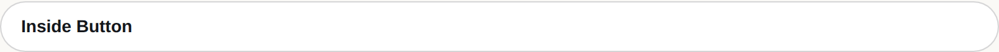
</picture>

```
buttonChild = Text("Inside Button")
root = Button(buttonChild, variant="default", action=Event("example", {component: "Button"}))
```

| prop | type | | what it is |
| --- | --- | --- | --- |
| `child` | componentid | **required** | The ID of the child component. Use a 'Text' component for a labeled button. Only use an 'Icon' if the requirements explicitly ask for an icon-only button. |
| `variant` | `default` \\| `primary` \\| `borderless` |  | A hint for the button style. If omitted, a default button style is used. 'primary' indicates this is the main call-to-action button. 'borderless' means the button has no visual border or background, making its child content appear like a clickable link. |
| `action` | action | **required** |  |

## CheckBox

<picture>
  <source media="(prefers-color-scheme: dark)" srcset="catalog/CheckBox-dark.png">
  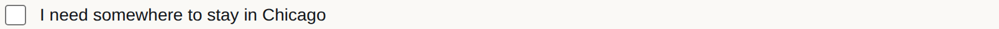
</picture>

```
root = CheckBox("I need somewhere to stay in Chicago", $/stops/1/needsStay)
```

| prop | type | | what it is |
| --- | --- | --- | --- |
| `label` | bindable string | **required** | The text to display next to the checkbox. |
| `value` | bindable boolean | **required** | The current state of the checkbox (true for checked, false for unchecked). |

## ChoicePicker

<picture>
  <source media="(prefers-color-scheme: dark)" srcset="catalog/ChoicePicker-dark.png">
  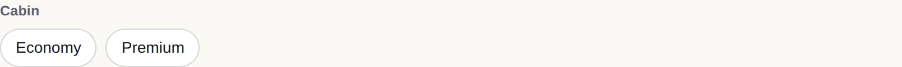
</picture>

```
root = ChoicePicker("Cabin", "mutuallyExclusive", [{label: "Economy", value: "economy"}, {label: "Premium", value: "premium"}], $/cabin)
```

| prop | type | | what it is |
| --- | --- | --- | --- |
| `label` | bindable string |  | The label for the group of options. |
| `variant` | `multipleSelection` \\| `mutuallyExclusive` |  | A hint for how the choice picker should be displayed and behave. |
| `options` | array | **required** | The list of available options to choose from. |
| `value` | bindable stringlist | **required** | The list of currently selected values. This should be bound to a string array in the data model. |
| `displayStyle` | `checkbox` \\| `chips` |  | The display style of the component. |
| `filterable` | boolean |  | If true, displays a search input to filter the options. |

## Column

<picture>
  <source media="(prefers-color-scheme: dark)" srcset="catalog/Column-dark.png">
  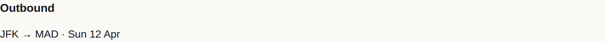
</picture>

```
a = Text("Outbound", variant="h4")
b = Text("JFK → MAD · Sun 12 Apr")
root = Column([a, b], align="stretch")
```

| prop | type | | what it is |
| --- | --- | --- | --- |
| `children` | childlist | **required** | Defines the children. Use an array of strings for a fixed set of children, or a template object to generate children from a data list. Children cannot be defined inline, they must be referred to by ID. |
| `justify` | `start` \\| `center` \\| `end` \\| `spaceBetween` \\| `spaceAround` \\| `spaceEvenly` \\| `stretch` |  | Defines the arrangement of children along the main axis (vertically). Use 'spaceBetween' to push items to the edges (e.g. header at top, footer at bottom), or 'start'/'end'/'center' to pack them together. |
| `align` | `center` \\| `end` \\| `start` \\| `stretch` |  | Defines the alignment of children along the cross axis (horizontally). This is similar to the CSS 'align-items' property. |

## DateRangePicker

<picture>
  <source media="(prefers-color-scheme: dark)" srcset="catalog/DateRangePicker-dark.png">
  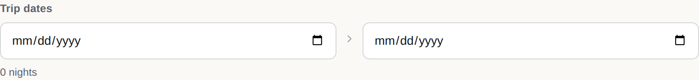
</picture>

```
root = DateRangePicker("Trip dates", $/trip/startDate, $/trip/endDate, nightsLabel=formatString("${calcNights(start: ${/trip/startDate}, end: ${/trip/endDate})} nights"))
```

| prop | type | | what it is |
| --- | --- | --- | --- |
| `label` | bindable string | **required** | What the range is for, e.g. 'When are you going?'. |
| `start` | bindable string | **required** | Bound path for the start date (RFC 3339). |
| `end` | bindable string | **required** | Bound path for the end date (RFC 3339). |
| `action` | action |  | Fired when the traveler commits a new range. |
| `nightsLabel` | bindable string |  | Derived caption, e.g. '6 nights'. |

## ExpenseSplit

<picture>
  <source media="(prefers-color-scheme: dark)" srcset="catalog/ExpenseSplit-dark.png">
  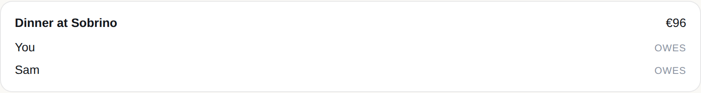
</picture>

```
root = ExpenseSplit("Dinner at Sobrino", "€96", [{name: "You"}, {name: "Sam"}])
```

| prop | type | | what it is |
| --- | --- | --- | --- |
| `title` | bindable string | **required** | What was paid for, e.g. 'Dinner at Sobrino'. |
| `total` | bindable string | **required** | Preformatted total, e.g. '€96'. |
| `participants` | array | **required** | Who is splitting it. Static values only. |
| `action` | action |  | Fired when the traveler settles or edits the split. |
| `actionLabel` | bindable string |  | Label for that action, e.g. 'Settle up'. |

## FlightOption

<picture>
  <source media="(prefers-color-scheme: dark)" srcset="catalog/FlightOption-dark.png">
  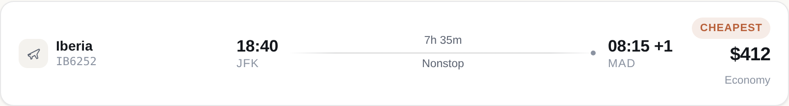
</picture>

```
root = FlightOption("Iberia", "18:40", "08:15 +1", "JFK", "MAD", "$412", Event("select_flight", {id: "IB6252"}), duration="7h 35m", stops="Nonstop", flightNumber="IB6252", cabin="economy", badge="Cheapest")
```

| prop | type | | what it is |
| --- | --- | --- | --- |
| `airline` | bindable string | **required** | Operating carrier, e.g. 'Iberia' or 'Delta'. |
| `departTime` | bindable string | **required** | Local departure time as a display string, e.g. '07:15'. |
| `arriveTime` | bindable string | **required** | Local arrival time as a display string. Append '+1' when the flight lands on the next day, e.g. '19:40 +1'. |
| `origin` | bindable string | **required** | Origin airport code, e.g. 'JFK'. |
| `destination` | bindable string | **required** | Destination airport code, e.g. 'MAD'. |
| `price` | bindable string | **required** | Preformatted price including currency, e.g. '$412'. |
| `action` | action | **required** | Fired when the traveler selects this flight. Required — an unselectable option is not an interface. |
| `duration` | bindable string |  | Total travel time as a display string, e.g. '7h 25m'. |
| `stops` | bindable string |  | Stop summary, e.g. 'Nonstop' or '1 stop · LIS'. |
| `flightNumber` | bindable string |  | Marketing flight number, e.g. 'IB6250'. |
| `cabin` | `economy` \\| `premium` \\| `business` \\| `first` |  | Cabin the price refers to. |
| `selected` | bindable boolean |  | Whether this option is currently chosen. Bind it to the data model so the selection survives a re-render. |
| `badge` | bindable string |  | Short editorial tag, e.g. 'Cheapest' or 'Fastest'. |

## HotelCard

<picture>
  <source media="(prefers-color-scheme: dark)" srcset="catalog/HotelCard-dark.png">
  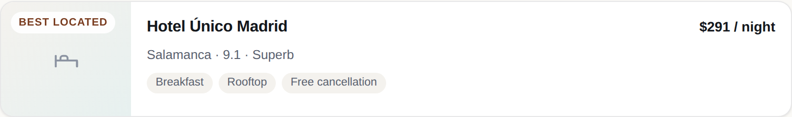
</picture>

```
root = HotelCard("Hotel Único Madrid", "$291 / night", Event("select_hotel", {id: "unico"}), neighborhood="Salamanca", rating="9.1 · Superb", amenities=["Breakfast", "Rooftop", "Free cancellation"], badge="Best located")
```

| prop | type | | what it is |
| --- | --- | --- | --- |
| `name` | bindable string | **required** | Property name. |
| `price` | bindable string | **required** | Preformatted nightly or total price, e.g. '$186 / night'. |
| `action` | action | **required** | Fired when the traveler picks or opens this property. |
| `imageUrl` | bindable string |  | Hero image URL. Omit for a generated placeholder. |
| `neighborhood` | bindable string |  | Where it is, in words a traveler uses, e.g. 'Malasaña'. |
| `rating` | bindable string |  | Rating as a display string, e.g. '4.6 (1,204)'. |
| `amenities` | array |  | Short amenity labels, at most five. Static values only. |
| `selected` | bindable boolean |  | Whether this property is currently chosen. |
| `badge` | bindable string |  | Short editorial tag, e.g. 'Walkable' or 'Best value'. |

## ItineraryDay

<picture>
  <source media="(prefers-color-scheme: dark)" srcset="catalog/ItineraryDay-dark.png">
  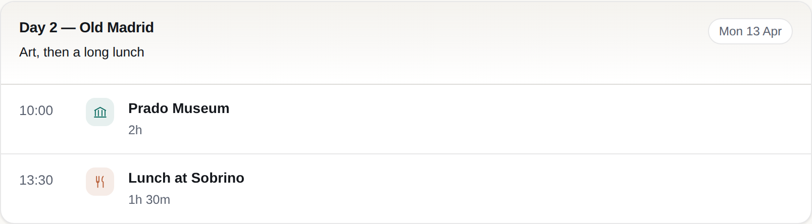
</picture>

```
a1 = ActivityItem("Prado Museum", "10:00", category="sight", duration="2h")
a2 = ActivityItem("Lunch at Sobrino", "13:30", category="food", duration="1h 30m")
root = ItineraryDay("Day 2 — Old Madrid", [a1, a2], date="Mon 13 Apr", summary="Art, then a long lunch")
```

| prop | type | | what it is |
| --- | --- | --- | --- |
| `title` | bindable string | **required** | Day heading, e.g. 'Day 3 — Toledo'. |
| `children` | childlist | **required** | The day's activities, earliest first. |
| `date` | bindable string |  | Date as a display string, e.g. 'Tue 14 Apr'. |
| `summary` | bindable string |  | One-line character of the day, e.g. 'Old town, slow pace'. |
| `action` | action |  | Fired when the traveler opens or edits the whole day. |

## List

<picture>
  <source media="(prefers-color-scheme: dark)" srcset="catalog/List-dark.png">
  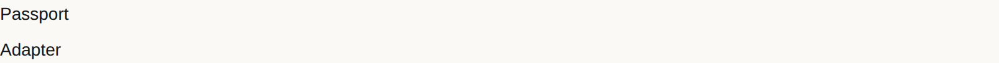
</picture>

```
$/items/0/label = "Passport"
$/items/1/label = "Adapter"
row = Text($label)
root = List(_template($/items, row))
```

| prop | type | | what it is |
| --- | --- | --- | --- |
| `children` | childlist | **required** | Defines the children. Use an array of strings for a fixed set of children, or a template object to generate children from a data list. |
| `direction` | `vertical` \\| `horizontal` |  | The direction in which the list items are laid out. |
| `align` | `start` \\| `center` \\| `end` \\| `stretch` |  | Defines the alignment of children along the cross axis. |

## MapPreview

<picture>
  <source media="(prefers-color-scheme: dark)" srcset="catalog/MapPreview-dark.png">
  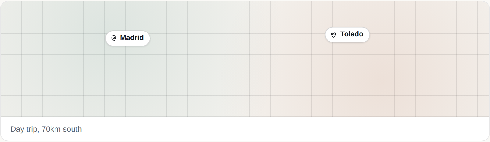
</picture>

```
root = MapPreview([{label: "Madrid"}, {label: "Toledo"}], caption="Day trip, 70km south")
```

| prop | type | | what it is |
| --- | --- | --- | --- |
| `markers` | array | **required** | Places to pin. Static values only — the host lays them out relative to each other. |
| `caption` | bindable string |  | One line describing what the map shows. |
| `action` | action |  | Fired when the traveler taps the map. |

## PriceSummary

<picture>
  <source media="(prefers-color-scheme: dark)" srcset="catalog/PriceSummary-dark.png">
  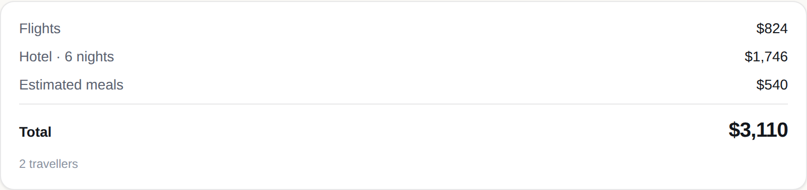
</picture>

```
root = PriceSummary([{label: "Flights", amount: "$824"}, {label: "Hotel · 6 nights", amount: "$1,746"}, {label: "Estimated meals", amount: "$540"}], total="$3,110", caption="2 travellers")
```

| prop | type | | what it is |
| --- | --- | --- | --- |
| `lines` | array | **required** | Itemized cost lines in display order. Static values only. |
| `total` | bindable string | **required** | Preformatted grand total, e.g. '$2,140'. |
| `totalLabel` | bindable string |  | What the total is called, e.g. 'Trip total'. |
| `action` | action |  | Primary money action, e.g. hold or book. |
| `actionLabel` | bindable string |  | Label for that action, e.g. 'Hold for 24h'. |
| `caption` | bindable string |  | Fine print, e.g. 'Estimated, taxes included'. |

## ProgressMeter

<picture>
  <source media="(prefers-color-scheme: dark)" srcset="catalog/ProgressMeter-dark.png">
  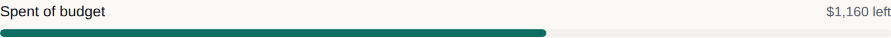
</picture>

```
root = ProgressMeter("Spent of budget", 1840, 3000, caption="$1,160 left")
```

| prop | type | | what it is |
| --- | --- | --- | --- |
| `label` | bindable string | **required** | What is progressing. |
| `value` | bindable number | **required** | Current amount. |
| `max` | bindable number | **required** | Amount that counts as complete. |
| `caption` | bindable string |  | Reading in words, e.g. '$1,320 of $2,000'. |
| `tone` | `neutral` \\| `positive` \\| `caution` \\| `critical` \\| `accent` |  | Colour role for the bar. |

## Row

<picture>
  <source media="(prefers-color-scheme: dark)" srcset="catalog/Row-dark.png">
  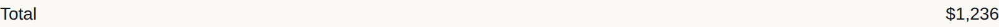
</picture>

```
a = Text("Total")
b = Text("$1,236")
root = Row([a, b], justify="spaceBetween")
```

| prop | type | | what it is |
| --- | --- | --- | --- |
| `children` | childlist | **required** | Defines the children. Use an array of strings for a fixed set of children, or a template object to generate children from a data list. Children cannot be defined inline, they must be referred to by ID. |
| `justify` | `center` \\| `end` \\| `spaceAround` \\| `spaceBetween` \\| `spaceEvenly` \\| `start` \\| `stretch` |  | Defines the arrangement of children along the main axis (horizontally). Use 'spaceBetween' to push items to the edges, or 'start'/'end'/'center' to pack them together. |
| `align` | `start` \\| `center` \\| `end` \\| `stretch` |  | Defines the alignment of children along the cross axis (vertically). This is similar to the CSS 'align-items' property, but uses camelCase values (e.g., 'start'). |

## Slider

<picture>
  <source media="(prefers-color-scheme: dark)" srcset="catalog/Slider-dark.png">
  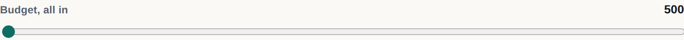
</picture>

```
root = Slider("Budget, all in", 500, 6000, $/trip/budget)
```

| prop | type | | what it is |
| --- | --- | --- | --- |
| `label` | bindable string |  | The label for the slider. |
| `min` | number |  | The minimum value of the slider. |
| `max` | number | **required** | The maximum value of the slider. |
| `value` | bindable number | **required** | The current value of the slider. |

## StatTile

<picture>
  <source media="(prefers-color-scheme: dark)" srcset="catalog/StatTile-dark.png">
  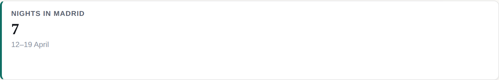
</picture>

```
root = StatTile("Nights in Madrid", "7", caption="12–19 April", tone="accent")
```

| prop | type | | what it is |
| --- | --- | --- | --- |
| `label` | bindable string | **required** | What the number measures. |
| `value` | bindable string | **required** | The number as a display string, e.g. '17'. |
| `caption` | bindable string |  | Context under the number, e.g. 'until Madrid'. |
| `tone` | `neutral` \\| `positive` \\| `caution` \\| `critical` \\| `accent` |  | Colour role for the tile. |
| `action` | action |  | Fired when the traveler taps the tile. |

## Text

<picture>
  <source media="(prefers-color-scheme: dark)" srcset="catalog/Text-dark.png">
  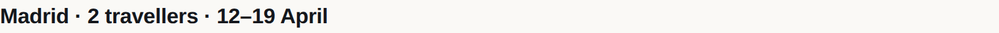
</picture>

```
root = Text("Madrid · 2 travellers · 12–19 April", variant="h3")
```

| prop | type | | what it is |
| --- | --- | --- | --- |
| `text` | bindable string | **required** | The text content to display. While simple Markdown formatting is supported (i.e. without HTML, images, or links), utilizing dedicated UI components is generally preferred for a richer and more structured presentation. |
| `variant` | `h1` \\| `h2` \\| `h3` \\| `h4` \\| `h5` \\| `caption` \\| `body` |  | A hint for the base text style. |

## TextField

<picture>
  <source media="(prefers-color-scheme: dark)" srcset="catalog/TextField-dark.png">
  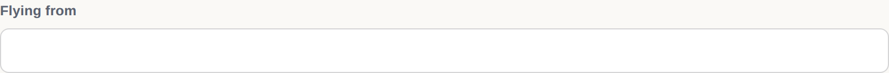
</picture>

```
root = TextField("Flying from", $/trip/origin, validationRegexp="^[A-Za-z]{3}$")
```

| prop | type | | what it is |
| --- | --- | --- | --- |
| `label` | bindable string | **required** | The text label for the input field. |
| `value` | bindable string |  | The value of the text field. |
| `variant` | `longText` \\| `number` \\| `shortText` \\| `obscured` |  | The type of input field to display. |
| `validationRegexp` | string |  | A regular expression used for client-side validation of the input. |

## TravelerCounter

<picture>
  <source media="(prefers-color-scheme: dark)" srcset="catalog/TravelerCounter-dark.png">
  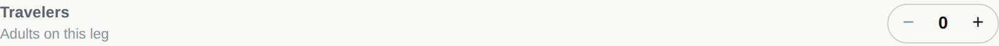
</picture>

```
root = TravelerCounter("Travelers", $/trip/travelers, min=1, max=9, caption="Adults on this leg")
```

| prop | type | | what it is |
| --- | --- | --- | --- |
| `label` | bindable string | **required** | What is being counted, e.g. 'Adults'. |
| `value` | bindable number | **required** | Bound path holding the current count. |
| `min` | integer |  | Lowest allowed count. |
| `max` | integer |  | Highest allowed count. |
| `caption` | bindable string |  | Qualifier, e.g. 'Age 12+'. |

## WeatherStrip

<picture>
  <source media="(prefers-color-scheme: dark)" srcset="catalog/WeatherStrip-dark.png">
  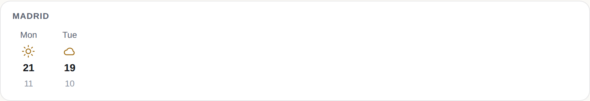
</picture>

```
root = WeatherStrip([{day: "Mon", high: 21, low: 11, condition: "sunny"}, {day: "Tue", high: 19, low: 10, condition: "cloudy"}], place="Madrid")
```

| prop | type | | what it is |
| --- | --- | --- | --- |
| `days` | array | **required** | Forecast entries in date order, at most seven. Static values only. |
| `place` | bindable string |  | Where the forecast is for. |
| `caption` | bindable string |  | One line of interpretation, e.g. 'Pack a light jacket'. |

---

## Drawn, but never offered to the model

Every renderer keeps its full component registry; the *prompt* is pruned. These
exist and work — a host can send them — but the agent is never told about them,
because a catalog the model does not need is tokens on every single turn.

| component | why it is pruned |
| --- | --- |
| `AudioPlayer` | no audio in a trip planner |
| `Video` | no video in a trip planner |
| `Modal` | the conversation is the modal; a surface that covers the chat hides the record |
| `Tabs` | the three surfaces are the navigation; tabs inside one of them compete with it |
| `Divider` | Column spacing already separates sections, and the model reaches for it as filler |
| `DateTimeInput` | DateRangePicker covers every date question this agent asks, and offering both invites a single-date control where a range belongs |
| `Icon` | ActivityItem takes a `category` and draws its own icon; WeatherStrip and the rest do the same. Nothing in the examples or in live traffic ever drew a bare one. |
| `Image` | HotelCard carries `imageUrl` and MapPreview draws itself. A loose image on a travel surface is a picture with no caption and no role. |
| `Card` | FlightOption, HotelCard, StatTile and PriceSummary *are* the cards, and they align across siblings in a way a generic container cannot. Keeping both taught the model two ways to draw a hotel. |
